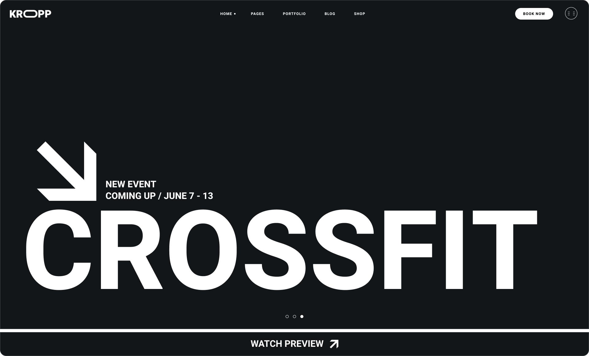

# Kropp

[](https://sabyrux.github.io/kropp-fitness/)

A landing page for the Kropp fitness club built to practice modern HTML and CSS development techniques and showcase front-end layout skills.

## Technologies

- HTML5
- CSS3
- Figma

## Features

- Semantic HTML markup
- Responsive design
- Accessibility-focused development
- Optimized WOFF2 fonts
- Clean and maintainable project structure

## Project Structure

```text
assets/
├── fonts/
├── icons/
└── images/

styles/
├── base/
├── components/
├── sections/
└── main.css

index.html
```

## Getting Started

No installation or build process is required.

Simply open `index.html` in your browser.

## Purpose

This project was created to improve HTML and CSS skills, practice responsive and semantic layout techniques, and demonstrate front-end development fundamentals.
